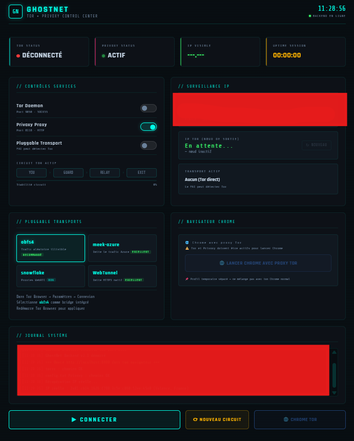
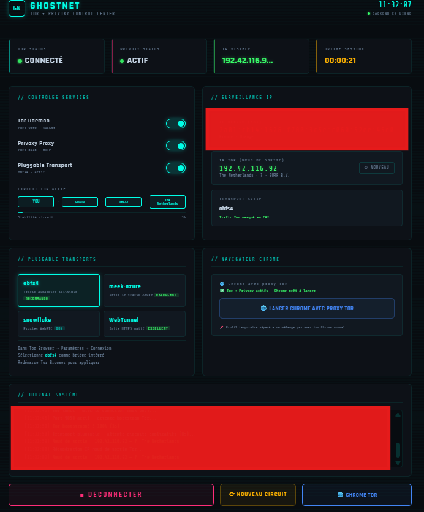
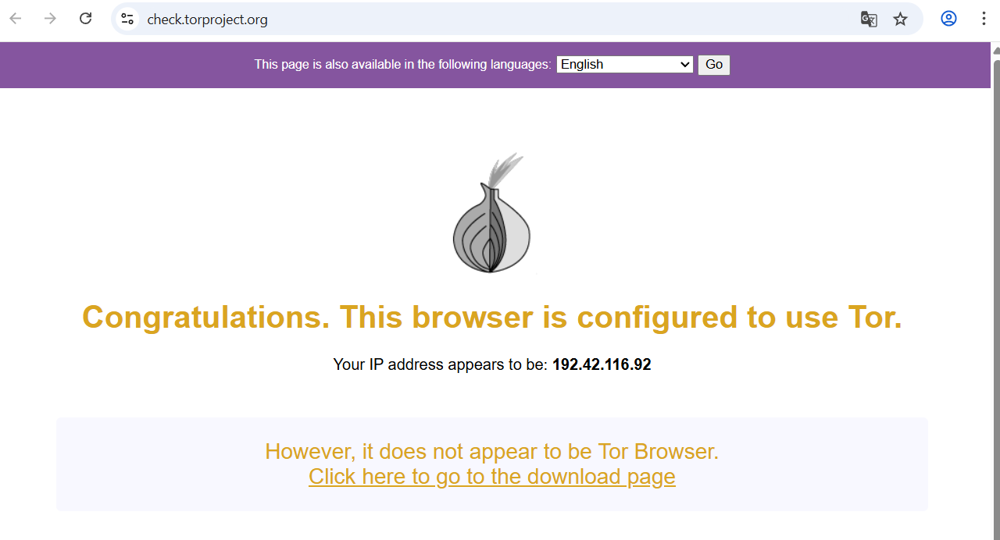

# GhostNet

Dashboard de contrôle Tor + Privoxy avec interface web locale.  
Lance Tor, change de circuit, navigue avec Chrome proxifié — le tout depuis `http://localhost:8000`.

---

## Screenshots

### Dashboard — déconnecté


### Dashboard — connecté avec obfs4 actif


### Chrome proxifié via Tor — vérification check.torproject.org


---

## Prérequis

- **Windows 10/11** (64-bit)
- **Python 3.10+** avec pip
- **Google Chrome** (optionnel — pour le bouton "Lancer Chrome avec Tor")

---

## Installation

### 1. Créer le virtualenv et installer les dépendances

```bat
python -m venv venv
venv\Scripts\pip install fastapi uvicorn requests[socks]
```

### 2. Télécharger Tor et Privoxy

```bat
venv\Scripts\python setup.py
```

Ce script télécharge et extrait automatiquement :
- **Tor Expert Bundle** (depuis archive.torproject.org) — avec vérification SHA256
- **Privoxy** (depuis privoxy.org)
- **7-Zip portable** (utilisé pour l'extraction)

Il génère aussi `tor/torrc` et `privoxy/config.txt` avec les chemins corrects pour ton installation.

> **Note :** setup.py ne télécharge les binaires qu'une seule fois.  
> Si tu le relances, il régénère uniquement les fichiers de config (utile après avoir déplacé le dossier).

---

## Utilisation

### Démarrer le backend

```bat
.\start.bat
```

ou directement :

```bat
venv\Scripts\python backend_v2.py
```

Puis ouvre **http://localhost:8000** dans ton navigateur.

Désactiver Pluggable Transport si probléme de connetion à tor et modifier le fichier torrc avec les nouveaux pont https://bridges.torproject.org/options

### Déplacer le projet

Si tu déplaces le dossier GhostNet vers un autre emplacement :

```bat
venv\Scripts\python setup.py
```

Relancer `setup.py` régénère `torrc` et `config.txt` avec les nouveaux chemins.  
Alternativement, `backend_v2.py` corrige les chemins automatiquement à chaque démarrage.

---

## Structure du projet

```
GhostNet/
├── backend_v2.py          # API FastAPI — contrôle Tor, Privoxy, circuits
├── tor_dashboard_v2.html  # Dashboard web (servi sur http://localhost:8000)
├── setup.py               # Installation de Tor et Privoxy
├── start.bat              # Lanceur Windows
│
├── tor/                   # Tor Expert Bundle (généré par setup.py)
│   ├── tor.exe
│   ├── lyrebird.exe       # Pluggable transports (obfs4, WebTunnel...)
│   └── torrc              # Config Tor (chemins auto-corrigés au démarrage)
│
├── privoxy/               # Privoxy (généré par setup.py)
│   ├── privoxy.exe
│   └── config.txt         # Config Privoxy (chemins auto-corrigés au démarrage)
│
├── data/
│   ├── tor_data/          # DataDirectory Tor (circuits, cookie d'auth...)
│   └── logs/              # Logs Tor et Privoxy
│
├── screenshot/            # Captures d'écran
│   ├── dashbord.png
│   ├── activer.png
│   └── navigateur.png
│
├── tools/                 # 7-Zip portable (utilisé par setup.py)
└── venv/                  # Virtualenv Python (non versionné)
```

---

## Fonctionnalités

| Fonctionnalité | Description |
|---|---|
| Démarrage Tor / Privoxy | Via toggles ou bouton CONNECTER |
| Nouveau circuit | NEWNYM avec cooldown 10s |
| Pluggable transports | obfs4, meek-azure, snowflake, WebTunnel |
| Bridges obfs4 | 4 bridges préconfigurés dans `backend_v2.py` |
| IP réelle / nœud de sortie | Affiché avec géolocalisation |
| Chrome proxifié | Profil temporaire isolé, proxy via Privoxy |
| Journal système | Logs backend en temps réel dans le dashboard |
| Auto-correction chemins | `torrc` et `config.txt` mis à jour au démarrage si le dossier a été déplacé |

---

## Ports utilisés

| Port | Service |
|---|---|
| `8000` | Backend GhostNet (API + dashboard) |
| `9050` | Tor SOCKS5 proxy |
| `9051` | Tor Control Port |
| `8118` | Privoxy HTTP proxy |

---

## Ajouter ses propres bridges

Édite `BRIDGES` dans `backend_v2.py` :

```python
BRIDGES: dict[str, list[str]] = {
    "obfs4": [
        "obfs4 IP:PORT FINGERPRINT cert=... iat-mode=0",
        # ajoute tes bridges ici
    ],
}
```

Les bridges obfs4 publics sont disponibles sur [bridges.torproject.org](https://bridges.torproject.org/).

---

## Sécurité

- Le backend écoute uniquement sur `127.0.0.1` — non exposé sur le réseau local
- Authentification Tor par cookie (pas de mot de passe en clair dans `torrc`)
- CORS restreint à `localhost`
- Les binaires Tor sont vérifiés par SHA256 (depuis archive.torproject.org)

---

## Dépendances Python

```
fastapi
uvicorn
requests[socks]
```